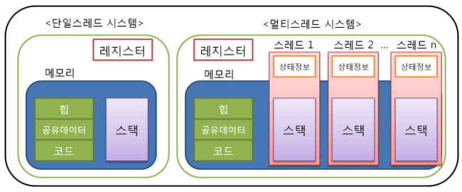

# 운영체제 

- [운영체제](#운영체제)
  - [컴퓨터 시스템 구성](#컴퓨터-시스템-구성)
  - [프로세스](#프로세스)
  - [스레드](#스레드)
  - [스케줄링](#스케줄링)
    - [스케줄링의 단계](#스케줄링의-단계)
    - [스케줄링 정책](#스케줄링-정책)
    - [스케줄링 알고리즘](#스케줄링-알고리즘)
  
## 컴퓨터 시스템 구성

* **프로세서**
  
    컴퓨터의 두뇌로(**중앙처리장치**) 연산 및 모든 장치의 동작을 제어한다. 

* **레지스터** 

    * 프로세서 내부에 있는 메모리로 프로세서 내에서 자료를 보관하는 아주 빠른 기억 장소이다.
    
    * 레지스터는 메모리 계층의 최상위에 위치하며, 가장 빠른 속도로 접근이 가능한 메모리이다.

* **메모리**
    
    데이터를 저장하는 장치(**기억하는 장치**)
    * 주기억장치(Main memory)
        
        * 프로세서가 수행할 프로그램과 데이터 저장하는 역할
        * DRAM을 주로 사용하며 용량이 크고, 가격이 저렴하다.
        * 디스크 입출력 병목현상(I/O bottleneck) 해소
  
    * 캐시(Cache)

        * 프로세서 내부에 있는 메모리로 속도가 빠르고, 가격이 비싸다.
        * 메인 메모리의 입출력 병목현상 해소

        > 캐시의 동작은 **캐시 히트**와 **캐시미스** 2가지의 동작으로 구분된다. 캐시 히트는 필요한 데이터 블록이 캐시에 존재하는 경우를 의미하고, 캐시 미스는 필요한 데이터 블록이 없는 경우를 의미한다. **만약에 필요한 데이터가 캐시에 존재하면 캐시 히트이므로 빠른 속도로 데이터를 처리할 수 있고, 데이터가 없으면 캐시 미스이므로 메인 메모리로 부터 데이터를 가져와야 하므로 속도가 느리다.**

* **보조기억장치**
  
    프로그램과 데이터를 저장하고 **프로세서가 직접 접근할 수 없다.** 주기억장치를 거쳐서 접근할 수 있다.

    |메모리의 종류|속도|용량|
    |---|---|---|
    |레지스터|매우 빠름|매우 작음
    |캐시|빠름| 작음
    |메인 메모리|느림|큼
    |보조기억장치|느림|매우 큼
---
## 프로세스
프로세스란 현재 실행 중인 프로그램으로 커널에 등록된 실행 단위를 의미한다.

* PCB(Process Control Block)
    
    커널 공간 내에 존재하며 각 프로세스들에 대한 정보를 관리한다. 프로세스를 생성 시, 생성된다.

* Resource(자원)

    자원이란 커널의 관리 하에 프로세스에게 할당 또는 반납되는 수동적 개체를 의미한다.

* 프로세스의 상태 
  
  

    |상태|의미|
    |---|---|
    |Created|작업을 커널에 등록, PCB를 할당 및 프로세스를 생성|
    |Ready|프로세서 외에 다른 모든 자원을 할당 받은 상태로 프로세서 할당을 대기하는 상태이다.|
    |Running|프로세서와 필요한 자원을 모두 할당 받은 상태를 의미한다.|
    |Blocked/Asleep| 프로세서 외에 다른 자원을 기다리는 상태로 입출력이 끝나면 Wake-up state가 되어 다시 ready state로 변경|
    |Suspended| 메모리를 할당 받지 못한(빼앗긴) 상태이다. **Swap-out**:메모리를 뺏기면서 swap device에 정보를 저장하는 상태, **Swap-in**:swap device로 부터 정보를 받아오는 상태로 2가지의 상태를 가진다.|
    |Terminated/Zombie|프로세스 수행이 끝난 상태로 모든 자원을 반납 후, 커널 내에 일부 PCB 정보만 남아 있는 상태|

* 인터럽트
    
    예상치 못한, 외부에서 발생한 이벤트

    * 처리 과정
   
        인터럽트 발생 -> 프로세스 중단 -> 인터럽트 처리 -> 인터럽트 발생 장소, 원인 파악(**Interrupt handling**) -> 인터럽트 서비스 여부 결정 -> 인터럽트 서비스 루틴 호출(**Interrupt service**)

    * **Context Switching**(문맥 교환)

        현재 실행 중인 프로세스의 context를 저장하고, 앞으로 실행 할 프로세스의 context를 복구하는 일을 의미한다. 여기서 context는 프로세스와 관련된 정보들의 집합이다.

        >**Context Switch Overhead**
        
        : Context switching에 소요되는 비용으로 불필요한 <u>Context switching을 줄이는 것</u>(스레드 사용)이 중요하다.
        

>**프로세스와 프로그램의 차이점**

: 프로그램은 보조기억장치에 존재하며 실행되기를 기다리는 **정적 데이터의 묶음**이다. 만약 이 프로그램이 자원을 할당받고 메모리에 적재되면 프로세스가 된다. 즉, 프로그램이 실행되면 프로세스가 된다.

>**CPU는 하나의 프로세스만 처리할 수 있는데 어떻게 동시에 다수의 프로세스를 실행할 수 있을까?** 

: CPU는 하나의 프로세스만 처리할 수 있는게 맞다. 운영체제는 이런 CPU가 사람이 인지하지 못할 속도로 <u>프로세스를 교체하며 실행</u>하고 있다. 그렇기에 사람이 보기에는 동시에 실행된다고 느끼게 된다.

---
## 스레드

프로세스 내에서 실행되는 여러 흐름의 단위이다. 프로세스가 할당 받은 자원을 이용하는 실행의 단위를 의미한다. 예를 들어서 보면, 크롬이라는 프로세스 내에서 동영상도 시청하고 웹 서핑, 다운로드 등의 다른 작업을 할 수 있다. 이것들을 하나 하나의 쓰레드라고 한다. 이때, 프로세스내에 있는 쓰레드들은 같은 자원을 공유하기 때문에 이들을 어떻게 공유하여 사용하는지가 중요하다.

* 멀티 프로세스 vs 멀티 스레드
    
    * 멀티 프로세스

        2개 이상 다수의 프로세서가 협력적으로 하나 이상의 작업을 동시에 처리하는 것을 의미한다. **프로세서 간 독립된 구조로 안정적이다.** 프로세스 중 하나에 문제가 생겨도 다른 프로세스에 영향을 주지 않기 때문에, 작업이 정지되지 않는다.하지만 **각각 독립된 영역을 가지고 있어 Context Switching이 많아지고 이로인해 오버헤드가 커지는 문제를 가진다.**

    
    * 멀티 스레드

        하나의 프로세스에 여러 스레드로 자원을 공유하며 작업을 나누어 수행하는 것을 의미한다. 멀티 스레드는 프로세스끼리 통신을 하지 않기 때문에 **사용자의 응답성이 향상된다.** 또한 자원을 공유해서 사용하기 때문에 **자원 효율이 높다.** 단점으로는 **한 스레드에 문제가 생기면, 전체 프로세스가 영향을 받게된다.** 또한 **스레드를 많이 사용하면 성능이 저하되고, 스레드가 동일한 자원을 공유하기 때문에 동기화 이슈가 발생한다.** 
* 스레드 구현
  
  * 사용자 수준 스레드

    사용자 영역의 스레드 라이브러리로 구현된다. 여기서 커널은 스레드의 존재를 모르기 때문에 커널의 관리를 받지 않는다. 커널에 독립적이기 때문에 모든 운영체제에서 사용가능하며 커널 영역으로 전환하는 오버헤드가 줄어든다. 하지만 하나의 프로세스에 할당된 여러개의 스레드 중 한 개의 스레드라도 대기상태가 되면 모든 스레드를 실행시킬 수 없다.

  * 커널 수준 스레드

    커널이 스레드와 관련된 모든 작업을 관리한다. 커널이 직접 스케줄링하고 자원을 관리하기 때문에 오버헤드가 늘어난다. 하지만 커널이 각 스레들을 개별적으로 관리하기 때문에 할당된 여러개의 스레드 중 한 개이 스레드가 대기상태가 되더라도 다른 스레드를 실행시킬 수 있다.
---
## 스케줄링
시스템 내부에는 여러개의 프로세스가 존재한다. 이때 자원(메모리)를 할당 할 프로세스를 선택하는 것을 **스케줄링**이라고 한다. 스케줄링은 시스템의 성능 향상을 목적으로 한다.

### 스케줄링의 단계
* Long-term Scheduling
  
    Job scheduling을 목적으로 하는 단계이다. 시스템 내의 프로세스 수를 조절하고 I/O-bounded, Compute-bounded 프로세스들을 잘 섞어서 선택해야 한다. *여기서 어떤 프로세스를 Ready상태의 큐로 넣을까를 결정한다.*

* Mid-term Scheduling

    메모리에 적재된 프로세스 수를 관리한다. 너무 많은 프로세스에게 메모리를 할당하면 프로세스 당 가지고 있는 메모리가 적어진다. 또한 Swapping 동작을 수행한다. swap-out은 프로세스의 정보가 주 메모리에서 보조저장장치에 위치한 swap 영역으로 옮겨지지는 것을 의미하고 swap-in은 swap영역에서 주 메모리로 옮겨지는 것을 의미한다.*가장 먼저 swap되는 프로세스들은 Blocked 상태의 프로세스이다.*

* Short-term Scheduling
  
    가장 빈번하게 발생하는 스케줄링으로 어떤 프로세스를 Running 상태로 만드는가를 결정한다. 

### 스케줄링 정책
* Non-Preemptive vs Preemptive

    * Non-Preemptive

        특정한 주체가 자원을 소유하고 있을 때 사용주체가 이를 놓아주기 전까지 그 어떤 개체도 자원을 뺏을 수 없다. 즉, 할당 받은 자원을 스스로 반납할 때까지 사용한다. 장점으로는 Context-switch overhead가 적다. 하지만 평균 응답 시간이 증가하는 단점을 가진다.

    * Preemptive

        특정 주체가 자원을 소유하고 있어서 다른 주체가 이를 뺏어올 수 있다. 즉, 시간 또는 우선순위에 의해서 타의에게 자원을 빼앗길 수 있다. 응답성이 좋아진다는 장점을 가지지만 Context switch overhead가 큰 단점을 가진다.

* Priority
  
    * Static priority(정적 우선순위)
        
        프로세스 생성시 결정된 priority가 유지된다. 구현이 쉽고, overhead가 적지만 환경 변화에 대한 대응이 어렵다.

    * Dynamic priority(동적 우선순위)

        프로세스 상태 변화에 따라 priority가 변경된다. 구현이 복잡하고, overhead가 크다. 하지만 시스템 환경 변화에 대한 유연한 대응이 가능하다.

### 스케줄링 알고리즘

* FCFS(First-Come-First-Service)
    
    먼저 온 것을 먼저 처리하는 알고리즘으로 **도착 시간을 기준**으로 프로세스를 처리한다. 스케줄링이 복잡하지 않아 overhead가 적다. 하지만 만약 하나의 프로세스가 너무 긴 수행시간을 가지게 되면 다른 프로세스들이 대기시간이 실행시간 보다 길어지는 현상이 발생한다. 이를 **Convoy effect** 라고 한다.

    
* RR(Round-Robin)
    
    FCFS와 같이 **도착 시간을 기준**으로 프로세스를 처리한다. 하지만 각 프로세스에게는 **자원 사용 제한 시간**이 있다. 할당된 시간이 지나면 자원을 반납하고 다음 프로세스에게 자원을 넘겨준다. 이를 통해 특정 프로세스의 자원 독점을 방지할 수 있다. 하지만 프로세스가 특정 시간마다 바뀌기 때문에 **Context switch overhead**가 큰 단점을 가진다.

* SPN(Shortest-Process-Next)
  
    **실행 시간을 기준**으로 프로세스를 처리한다. 평균 대기시간을 최소화하고 시스템 내 프로세스 수를 최소화 하여 시스템의 효율을 높일 수 있다. 하지만 실행시간이 긴 프로세스는 계속 자원을 할당받지 못하는 **Starvation(기아현상)**이 발생할 수 있다. 

* SRTN(Shortest-Remaining-Time-Next)
  
    Preemptive scheduling으로 잔여 실행 시간이 더 적은 프로세스가 Ready상태가 되면 선점된다. SPN의 장점을 극대화할 수 있지만 잔여 실행을 계속 추적해야하므로 overhead가 커지고 context switching ovehead도 커진다.
    -> 구현 및 사용이 비현실적

* HRRN(High-Response-Ratio-Next)

    프로세스의 대기 시간을 고려(Aging concepts)하여 기회를 제공한다. 스케줄링의 기준으로 Response ratio가 높은 프로세스를 우선으로 한다. 
    **Response ratio = (WT + BT) / BT**

* MLQ(Multi-Level-Queue)
  
    작업 또는 우선순위별 별도의 Ready Queue를 가진다. 최초 배정된 Queue를 벗어나지 못한다. 빠른 응답시간을 가지지만 우선순위가 낮은 Queue는 starvation 현상이 발생한다.

* MFQ(Multi-Level-Feedback-Queue)

    프로세스의 Queue간 이동이 허용된 MLQ이다. Feedback을 통해 우선 순위를 조정할 수 있다. 스케줄링 overhead가 크고 starvation문제가 생긴다. 