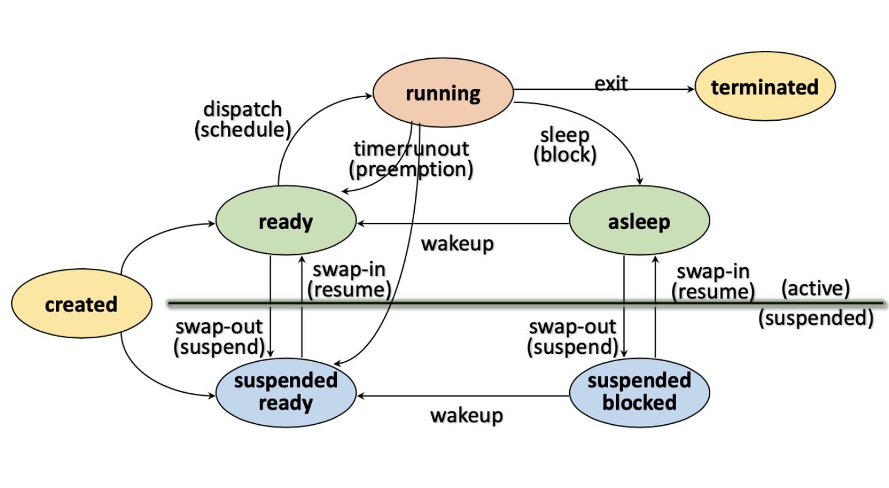

# 운영체제 

- [운영체제](#운영체제)
  - [컴퓨터 시스템 구성](#컴퓨터-시스템-구성)
  - [프로세스](#프로세스)

## 컴퓨터 시스템 구성

* **프로세서**
  
    컴퓨터의 두뇌로(**중앙처리장치**) 연산 및 모든 장치의 동작을 제어한다. 

* **레지스터** 

    * 프로세서 내부에 있는 메모리로로 프로세서 내에서 자료를 보관하는 아주 빠른 기억 장소이다.
    
    * 레지스터는 메모리 계층의 최상위에 위치하며, 가장 빠른 속도로 접근이 가능한 메모리이다.

* **메모리**
    
    데이터를 저장하는 장치(**기억하는 장치**)
    * 주기억장치(Main memory)
        
        * 프로세서가 수행할 프로그램과 데이터 저장하는 역할
        * DRAM을 주로 사용하며 용량이 크고, 가격이 저렴하다.
        * 디스크 입출력 병목현상(I/O bottleneck) 해소
  
    * 캐시(Cache)

        * 프로세서 내부에 있는 메모리로 속도가 빠르고, 가격이 비싸다.
        * 메인 메모리의 입출력 병목현상 해소

        > 캐시의 동작은 **캐시 히트**와 **캐시미스** 2가지의 동작으로 구분된다. 캐시 히트는 필요한 데이터 블록이 캐시에 존재하는 경우를 의미하고, 캐시 미스는 필요한 데이터 블록이 없는 경우를 의미한다. **만약에 필요한 데이터가 캐시에 존재하면 캐시 히트이므로 빠른 속도로 데이터를 처리할 수 있고, 데이터가 없으면 캐시 미스이므로 메인 메모리로 부터 데이터를 가져와야 하므로 속도가 느리다.**

* **보조기억장치**
  
    프로그램과 데이터를 저장하고 **프로세서가 직접 접근할 수 없다.** 주기억장치를 거쳐서 접근할 수 있다.

    |메모리의 종류|속도|용량|
    |---|---|---|
    |레지스터|매우 빠름|매우 작음
    |캐시|빠름| 작음
    |메인 메모리|느림|큼
    |보조기억장치|느림|매우 큼
---
## 프로세스
프로세스란 현재 실행 중인 프로그램으로 커널에 등록된 실행 단위를 의미한다.

* PCB(Process Control Block)
    
    커널 공간 내에 존재하며 각 프로세스들에 대한 정보를 관리한다. 프로세스를 생성 시, 생성된다.

* Resource(자원)

    자원이란 커널의 관리 하에 프로세스에게 할당 또는 반납되는 수동적 개체를 의미한다.

* 프로세스의 상태 
  
  

    |상태|의미|
    |---|---|
    |Created|작업을 커널에 등록, PCB를 할당 및 프로세스를 생성|
    |Ready|프로세서 외에 다른 모든 자원을 할당 받은 상태로 프로세서 할당을 대기하는 상태이다.|
    |Running|프로세서와 필요한 자원을 모두 할당 받은 상태를 의미한다.|
    |Blocked/Asleep| 프로세서 외에 다른 자원을 기다리는 상태로 입출력이 끝나면 Wake-up state가 되어 다시 ready state로 변경|
    |Suspended| 메모리를 할당 받지 못한(빼앗긴) 상태이다. **Swap-out**:메모리를 뺏기면서 swap device에 정보를 저장하는 상태, **Swap-in**:swap device로 부터 정보를 받아오는 상태로 2가지의 상태를 가진다.|
    |Terminated/Zombie|프로세스 수행이 끝난 상태로 모든 자원을 반납 후, 커널 내에 일부 PCB 정보만 남아 있는 상태|

* 인터럽트
    
    예상치 못한, 외부에서 발생한 이벤트

    * 처리 과정
   
        인터럽트 발생 -> 프로세스 중단 -> 인터럽트 처리 -> 인터럽트 발생 장소, 원인 파악(**Interrupt handling**) -> 인터럽트 서비스 여부 결정 -> 인터럽트 서비스 루틴 호출(**Interrupt service**)

    * **Context Switching**(문맥 교환)

        현재 실행 중인 프로세스의 context를 저장하고, 앞으로 실행 할 프로세스의 context를 복구하는 일을 의미한다. 여기서 context는 프로세스와 관련된 정보들의 집합이다.

        >**Context Switch Overhead**
        
        : Context switching에 소요되는 비용으로 불필요한 <u>Context switching을 줄이는 것</u>(스레드 사용)이 중요하다.
        

>**프로세스와 프로그램의 차이점**

: 프로그램은 보조기억장치에 존재하며 실행되기를 기다리는 **정적 데이터의 묶음**이다. 만약 이 프로그램이 자원을 할당받고 메모리에 적재되면 프로세스가 된다. 즉, 프로그램이 실행되면 프로세스가 된다.

>**CPU는 하나의 프로세스만 처리할 수 있는데 어떻게 동시에 다수의 프로세스를 실행할 수 있을까?** 

: CPU는 하나의 프로세스만 처리할 수 있는게 맞다. 운영체제는 이런 CPU가 사람이 인지하지 못할 속도로 프로세스를 교체하며 실행하고 있다. 그렇기에 사람이 보기에는 동시에 실행된다고 느끼게 된다.